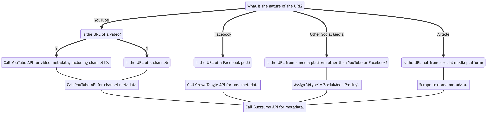

# defacto-enrichment-public

Scripts and documentation for De Facto database enrichment.

## [ClaimReview Schema](schemas/schema.adoc)

## Description

The De Facto project's database aggregates fact-checks and makes them available via an RSS feed. Therefore, metadata attached to the fact-checks and the claims they investigate must be in JSON-LD format and follow the ClaimReview and MediaReview schemas, which are commonly used by fact-checkers. We depend as much as possible on the schemas' standards. However, enriched metadata from social media platforms requires the invention of some new ClaimReview properties and types, whose schema is documented on the [AFP-Medialab GitHub repository](https://github.com/AFP-Medialab/defacto-rss/blob/main/Defactor_rss.adoc).

All information about the enrichments achieved with the [`defacto-enrichment`](defacto-enrichment) workflow are documented in this repository in [`schema.adoc`](schemas/schema.adoc). The enrichment relies on the Python library [`minall`](https://github.com/medialab/minall), which leverages the many platform-specific API client wrappers of [`minet`](https://github.com/medialab/minet) to collect data about the various claims in the database.

## Enrichment procedure

`minall` uses the following logic, as represented in this decision tree, to process each URL in the data set.

